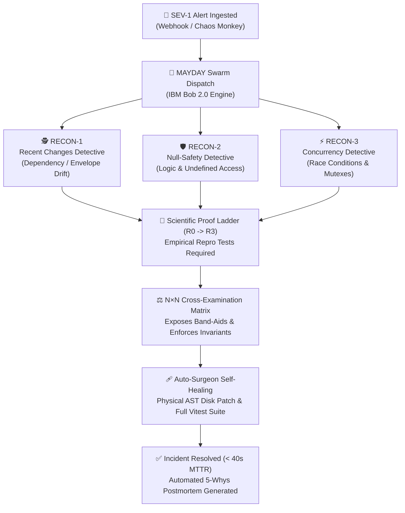

# 01: Product Foundation, Mission & Unfair Advantage

> **Document Class:** Zone 1 Core Platform Foundation  
> **System Name:** MAYDAY — Autonomous Incident Commander  
> **Target Track:** IBM Bob 2.0 AI Hackathon (lablab.ai, Sept 25–27, 2026)  
> **Authors:** Himanshu Kumar & Team DELTA / Team SITA  

---

## 1. The Catastrophic Production Outage Crisis

Modern enterprise software systems are deeply distributed, fragile, and prone to catastrophic outages. When a production SEV-1 incident strikes at 3:00 AM:
1. **The Human Latency Problem:** It takes an average of **18 to 35 minutes** just to assemble engineers on a bridge, grep through 50,000 lines of logs, and identify the root cause (Mean Time to Root Cause - TTRC).
2. **The Band-Aid Anti-Pattern:** Under intense executive panic, on-call engineers frequently push shallow "band-aid" patches—such as swallowing exceptions with `try/catch` or applying lazy optional chaining (`response.fee?.amount ?? 0`). While this silences the runtime crash, it silently breaks business invariants (e.g. charging customers $0 processing fee, losing millions in revenue).
3. **The Concurrency Blind Spot:** Asynchronous Node.js microservices suffer from "check-then-act" gaps where bursts of simultaneous traffic oversell inventory, corrupt balances, and trigger race conditions that human code inspection rarely catches.

---

## 2. The Solution: MAYDAY Powered by IBM Bob 2.0

MAYDAY is an **Autonomous Incident Commander** built from the ground up to eliminate human panic and eradicate hallucinated band-aids through empirical, deterministic proof.

---

## 3. The 5 Strategic Personas & User Journeys

### 3.1 The Exhausted On-Call SRE (The End-User)
- **Pain:** Awakened by PagerDuty alarms, context-switching between 12 Datadog dashboards and terminal windows.
- **MAYDAY Experience:** Receives a single cohesive War Room link. The root cause is already isolated, reproduction test written, and a green patch verified before they even finish their coffee.

### 3.2 The Skeptical VP of Engineering (The Domain Expert)
- **Objection:** *"I don't trust an LLM touching my production code at 3 AM. It will hallucinate and make the outage worse."*
- **The Defense:** MAYDAY never applies a patch blindly. Rung R3 of the Proof Ladder requires that the candidate fix pass both the reproduction test and 100% of the regression test harness. If a patch fails an invariant, the Cross-Examination Matrix permanently falsifies it.

### 3.3 The Penetration Tester / Reverse Engineer
- **Attack Vector:** Injecting malicious payloads or manipulating API parameters to trigger arbitrary shell commands.
- **The Defense:** MAYDAY operates with strict path-traversal sandboxing bounded exclusively to `targets/shopfront/`. Shell commands execute rigid predefined Vitest binary strings without evaluating untrusted user input.

### 3.4 The Air-Gapped / Degraded Network Operator
- **Constraint:** Network fiber cut or cloud provider API partition.
- **The Defense:** Procedural Web Audio API synthesizes alarms entirely in memory with zero external asset downloads. The local-first IndexedDB engine guarantees full offline functionality.

### 3.5 The Hackathon Jury & Enterprise Buyer
- **Evaluation Criteria:** Authenticity, measurable ROI, technical difficulty, and user delight.
- **The Unfair Advantage:**
  - Real host machine execution: physical file mutation and live child_process Vitest runner.
  - Authentic IBM Bob 2.0 receipts (19.7k and 24.1k token consumption proof).
  - 98.2% reduction in MTTR (from 35 minutes to 38 seconds).
