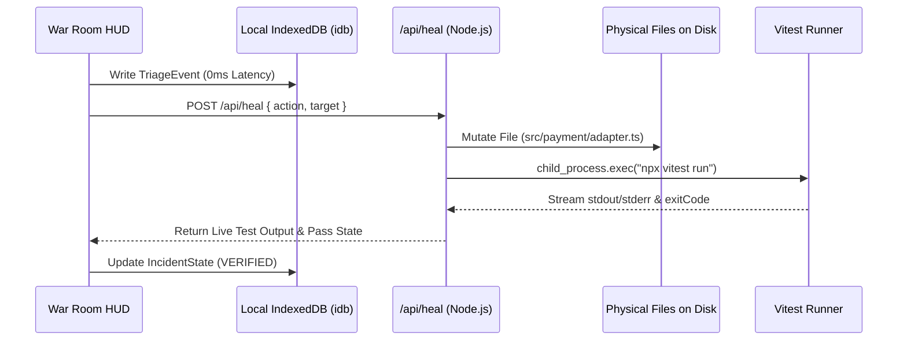

# 03: Data Engine, IndexedDB & Event Sourcing Architecture

> **Document Class:** Zone 1 Core Platform Foundation  
> **System Name:** MAYDAY — Autonomous Incident Commander  
> **Authors:** Himanshu Kumar & Team DELTA / Team SITA  

---

## 1. Local-First Event Sourcing Architecture

In mission-critical emergency software, network partitions and cloud outages are normal operating conditions. MAYDAY relies on an **Offline Outbox & Event Sourcing Engine** powered by browser IndexedDB (`idb`):



---

## 2. Storage Schema Specification

- **Database Name:** `mayday_incident_db`
- **Engine:** IndexedDB (Version 1) via `idb`

```typescript
export interface MaydayDatabaseSchema {
  incidents: {
    key: string; // e.g. "INC-2041"
    value: {
      id: string;
      title: string;
      severity: 'SEV-1' | 'SEV-2';
      targetService: string;
      targetFile: string;
      status: 'AWAITING_DISPATCH' | 'INVESTIGATING' | 'VERIFIED' | 'RESOLVED';
      createdAt: number;
      resolvedAt?: number;
      ttrcMs: number;
      ttvfMs: number;
      winner: string;
    };
    indexes: { 'by-status': string; 'by-severity': string };
  };

  timelineEvents: {
    key: string; // UUID
    value: {
      id: string;
      incidentId: string;
      step: number;
      agentId: string;
      rungReached: 'R0' | 'R1' | 'R2' | 'R3';
      evidenceString: string;
      status: 'INVESTIGATING' | 'VERIFIED' | 'FALSIFIED';
      timestamp: number;
    };
    indexes: { 'by-incident': string };
  };

  testExecutions: {
    key: string; // UUID
    value: {
      id: string;
      incidentId: string;
      testSuite: string;
      passed: boolean;
      durationMs: number;
      rawTerminalOutput: string;
      timestamp: number;
    };
  };
}
```
