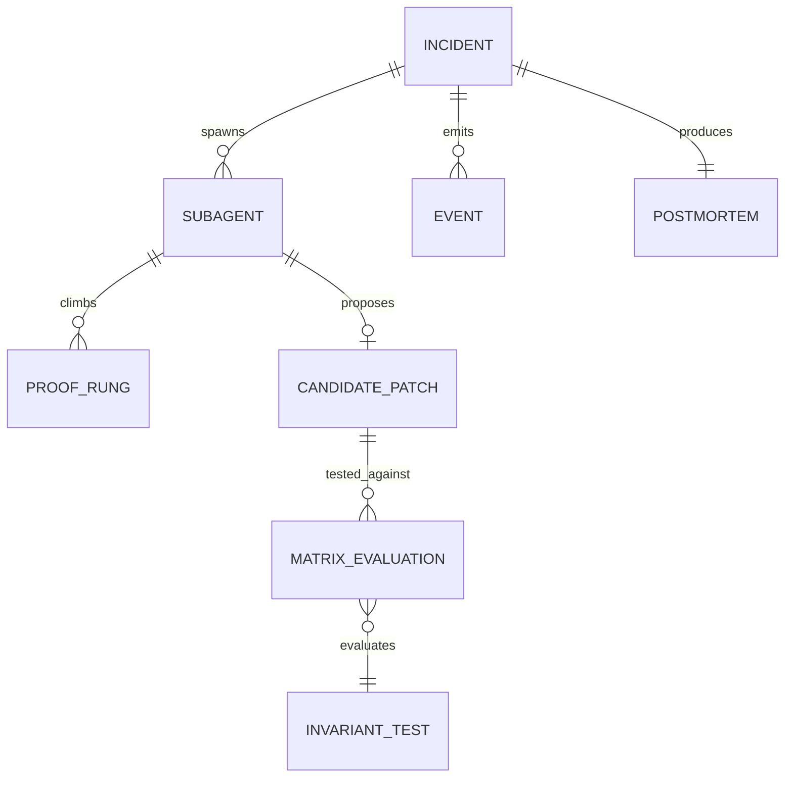

# 📐 04_INFORMATION_ARCHITECTURE.md — Data Models & State Machine
### *MAYDAY: Autonomous Incident Commander Powered by IBM Bob 2.0*
*Document Class: Tier 1 Specification · Author: Team SITA (Himanshu Kumar & Priyansu Modi)*

---

## 1. Core Entity Relationship Diagram (ERD)



---

## 2. Event-Sourced Incident State Machine

Every incident in MAYDAY follows a strict, deterministic finite state machine (FSM):

```
[ AWAITING_DISPATCH ]
          │
          ▼ (User clicks Launch / Chaos Injection)
     [ TRIAGING ]  ──► (RECON subagents scan git blame, imports, logs)
          │
          ▼ (Culprit lines located)
    [ REPRODUCING ] ──► (Vitest repro test fails on untouched code)
          │
          ▼ (Candidate patches submitted)
  [ CROSS_EXAMINING ] ──► (N×N Matrix evaluates invariant outcomes)
          │
          ▼ (Decoy band-aids eliminated, champion crowned)
   [ SELF_HEALING ] ──► (Surgeon applies patch, runs test suite)
          │
          ├───────────────────────────────┐
          ▼ (All suites green)            ▼ (Upstream external failure)
     [ RESOLVED ]                   [ ESCALATED ]
  (PR opened, Postmortem)        (Human SRE paged)
```

---

## 3. The Event Schema (`cases/*.json`)

```typescript
interface IncidentEvent {
  t: number;                // Milliseconds elapsed since incident start
  type:                     // Event discriminator
    | 'incident.received'
    | 'triage.completed'
    | 'agent.spawned'
    | 'agent.evidence'
    | 'agent.falsified'
    | 'agent.rung'
    | 'matrix.result'
    | 'verdict.declared'
    | 'fix.attempt'
    | 'test.result'
    | 'pr.ready'
    | 'postmortem.ready';
  payload: Record<string, any>;
}
```
