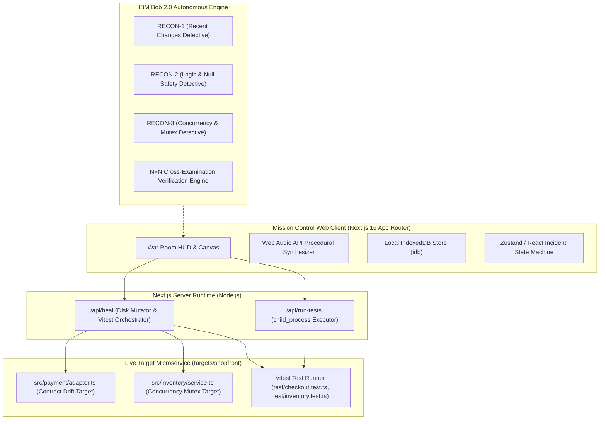

# 08: Technical Architecture & Topology

> **Document Class:** Technical Architecture Document (Tier 3)  
> **System Name:** MAYDAY — Autonomous Incident Commander  
> **Parent Blueprint:** [`UNIVERSAL_APP_CREATION_ENGINE_AND_EXECUTION_BLUEPRINT.md`](file:///d:/VS%20Code%20Workspaces/7.%20Google%20ai.studio/2-Plans/UNIVERSAL_APP_CREATION_ENGINE_AND_EXECUTION_BLUEPRINT.md)  
> **Authors:** Himanshu Kumar & Team DELTA / Team SITA  

---

## 1. System Topology Overview

MAYDAY operates as a hybrid local-first Autonomous Incident Commander. It bridges high-level browser-based orchestration with real OS-level child processes and live Node microservices.

---

## 2. Core Architectural Pillars

### 2.1 The Two-Tier Target Isolation Model
To ensure absolute fidelity without risking production environments, MAYDAY uses a dual-workspace structure:
1. **The Mission Control Plane (`web/`):** Next.js 16 App Router interface running with Webpack fallback for universal cross-platform compatibility (Windows, macOS, Linux, and Cloudflare Edge).
2. **The Target Fleet (`targets/shopfront/`):** A genuine Express/TypeScript e-commerce service with real business logic (checkout fee processing and inventory reservations) and an automated Vitest regression harness.

### 2.2 Local Child Process Execution Bridge
Unlike mock dashboards that simulate progress with `setTimeout`, MAYDAY's server routes use Node.js `child_process.exec` to execute real test suites against real code on disk:
- When a fault is injected, the file is physically altered on disk, and Vitest runs to capture the true failure trace.
- When an IBM Bob 2.0 patch is applied, the code is surgically rewritten on disk, and Vitest is invoked synchronously to prove that 100% of unit tests pass.

### 2.3 Acoustic Feedback Subsystem
Built using the browser's native Web Audio API (`AudioContext`), MAYDAY generates procedural audio cues directly in code without downloading heavy audio assets:
- **880 Hz Pulsing Square Wave:** SEV-1 Klaxon alarm.
- **1760 Hz High-Q Sine Ping:** Radar ping when an incident is ingested.
- **220 Hz Sawtooth Buzz:** Test regression or falsified hypothesis.
- **1046.5 Hz (C6) Harmonic Chime:** Verified Crown Fix.

---

## 3. Technology Stack Reference
| Component | Selection | Justification |
|---|---|---|
| **Framework** | Next.js 16.3.6 (App Router) | Server-side execution routes + client-side reactive War Room HUD |
| **Language** | TypeScript 5.8 | End-to-end type safety across incident schemas and test runners |
| **Bundler** | Webpack 5 (`--webpack`) | Rock-solid native Windows stability, avoiding MSVC WASM binary mismatches |
| **Testing Harness** | Vitest 1.6.1 | Sub-second execution times (~1.1s for complete suite) |
| **Styling** | Tailwind CSS v4 | Curated dark mode glassmorphism palette and high-contrast alert tokens |
| **Storage** | IndexedDB (`idb`) | 0ms local persistence for incident logs, postmortems, and offline triage |
| **AI Driver** | IBM Bob 2.0 | Multi-agent competing hypotheses, code rewriting, and token ledger tracking |
