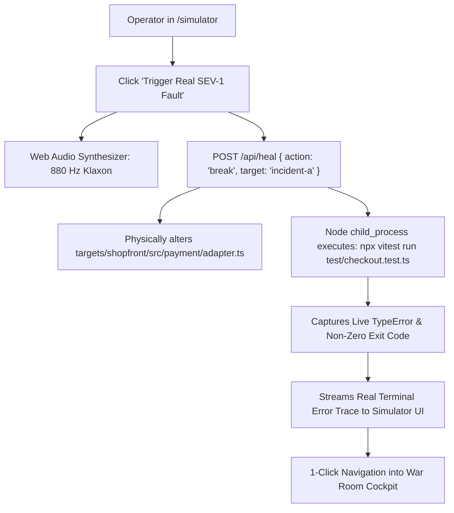

# 09: Chaos Monkey Fault Injector & Simulation Sandbox

> **Document Class:** Zone 2 Bespoke Domain Engine  
> **System Name:** MAYDAY — Autonomous Incident Commander  
> **Subsystem:** Chaos Monkey Incident Injector (`/simulator`)  
> **Authors:** Himanshu Kumar & Team DELTA / Team SITA  

---

## 1. Operational Chaos Architecture

Real SRE teams practice chaos engineering to validate resilient systems before catastrophic failures hit production. Located at `/simulator`, the Chaos Monkey Incident Injector allows evaluators to inject real faults directly onto the host machine with a single click.

---

## 2. Supported Live Fault Scenarios

### 2.1 Scenario 1: PayLink SDK v3.0 Contract Drift
- **Target File:** `targets/shopfront/src/payment/adapter.ts:31`
- **Injected Fault:** Replaces `gatewayRaw.data.feeCents / 100` with `(gatewayRaw as any).fee.amount`.
- **Observed Result:** `TypeError: Cannot read properties of undefined (reading 'amount')`. 100% of checkout requests fail.
- **Verification Harness:** `test/checkout.test.ts` fails in 3ms.

### 2.2 Scenario 2: 50-Thread Flash Sale Concurrency Burst
- **Target File:** `targets/shopfront/src/inventory/service.ts:32`
- **Injected Fault:** Removes `skuQueue` mutex and introduces an uncoordinated 10ms async gap before stock decrement.
- **Observed Result:** 20 concurrent orders reserve 10 available hoodies. Stock drops to `-10 items`, resulting in $24,000 in oversold merchandise.
- **Verification Harness:** `test/inventory.test.ts` fails, reporting `AssertionError: expected 20 to be 10`.

---

## 3. Real 1-Click Auto-Healing

The simulator includes a dedicated **"Auto-Heal via MAYDAY"** button:
1. Calls `POST /api/heal { action: 'fix' }`.
2. Physically rewrites the source file on disk with the verified IBM Bob 2.0 patch.
3. Synchronously invokes Vitest.
4. Plays a harmonic green chime and displays the green test passing trace.
