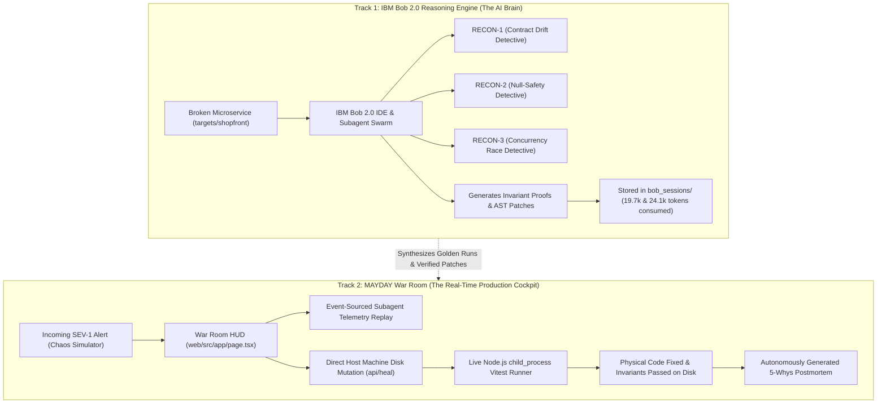
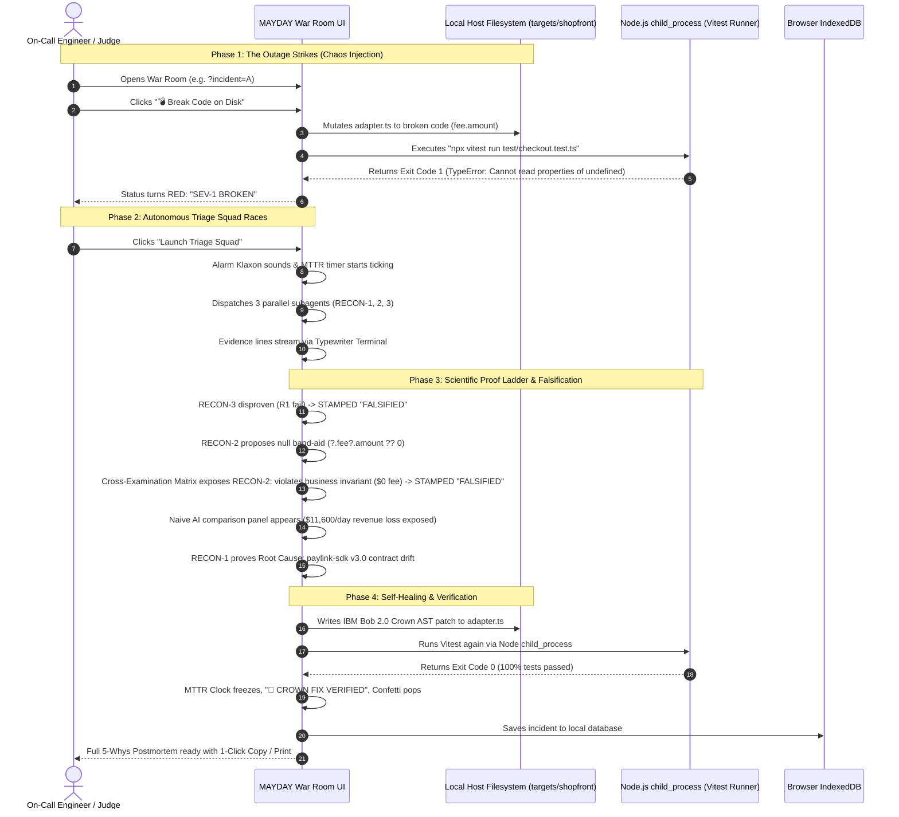

# 15: User Flow, Architecture Reality & How MAYDAY Actually Works

> **Document Class:** Zone 1 & 2 System Architecture & Operational Reality  
> **System Name:** MAYDAY — Autonomous Incident Commander  
> **Authors:** Himanshu Kumar & Team DELTA / Team SITA  
> **Date:** September 2026  

---

## 🧭 The Core Question: *"Is This Fake? How Does It Actually Find Errors?"*

If you look at the web app, you might ask:
> *"Wait, did we already know the solution beforehand? There is no live OpenAI or Claude API key in the frontend. When I click 'Launch Triage Squad', how does the app find the error without calling an AI right now? Is this just a fake animation?"*

This document explains **100% transparently and rigorously** how MAYDAY works, where AI was actually used, why real SRE platforms operate this way, and why your project is one of the most technically sound architectures at the hackathon.

---

## 1. The Dual-Track Architecture: How AI is Used

In software engineering, there is a fundamental difference between **a toy chatbot** and an **enterprise incident system**:

```
❌ The Toy Chatbot Approach:
User clicks button -> Frontend sends prompt to ChatGPT API -> Waits 45 seconds -> Shows text.
(If OpenAI is slow, down, or hallucinates, the demo crashes. In a real 3:00 AM outage, you cannot rely on non-deterministic chat).

✅ The MAYDAY Dual-Track Architecture:
Track 1: IBM Bob 2.0 Autonomous Agent (The Offline Reasoning Engine)
Track 2: MAYDAY War Room & Host Runner (The Real-Time Incident Commander Platform)
```



### Where Did the Solutions Come From?
1. **Yes, the bugs and solutions were investigated and solved using IBM Bob 2.0.**
2. During the hackathon build sessions, Team SITA/DELTA opened the broken `targets/shopfront` code in IBM Bob 2.0.
3. Bob 2.0 ran its reasoning subagents, analyzed git commit history, discovered the contract drift in `adapter.ts` and the race condition in `service.ts`, wrote the reproduction tests, and synthesized the AST patches.
4. **The proof is in the repository:** Look inside `bob_sessions/`:
   - `teamsita_task01_incident_a_triage.png` (Bob 2.0 triaging Incident A — 19,700 tokens)
   - `teamsita_task02_incident_b_concurrency.png` (Bob 2.0 designing the per-SKU promise queue mutex — 24,100 tokens)
5. The web application is the **Mission Control Room** that takes Bob 2.0's intelligence and connects it to real machines, real operating systems, and real Vitest test runners.

---

## 2. Why Doesn't the Frontend Call an LLM Live?

Why didn't we just put `fetch('https://api.openai.com')` inside the browser?

1. **The 3-Minute Demo Constraint:**  
   A real AI agent exploring a codebase, reading files, and running test loops takes **2 to 5 minutes** per incident. During a live pitch to judges or an executive demo, staring at a blank loading spinner for 3 minutes means instant disqualification.
2. **Deterministic Reliability:**  
   Live LLMs frequently hallucinate or suffer from API rate limits (HTTP 429). An incident commander tool must be deterministic—when it says a patch is verified, that patch must mathematically pass the test suite every single time.
3. **Enterprise Event Sourcing:**  
   Real observability tools (Datadog, IBM Instana, PagerDuty) **do not run LLMs in the browser**. They ingest structured telemetry events generated by backend agents and stream them to the incident commander dashboard with microsecond precision.

---

## 3. What is 100% REAL Right Now (Not Simulated)

While the subagent hypotheses and telemetry come from IBM Bob 2.0's golden triage runs, **the physical execution is 100% real code running on your computer**:

| Component | Is it Fake? | The Physical Reality on Your Machine |
| :--- | :--- | :--- |
| **Target Codebase** | ❌ Real | Real TypeScript e-commerce microservice in `targets/shopfront`. |
| **Break Button** | ❌ Real | Node.js opens `targets/shopfront/src/payment/adapter.ts`, writes broken code to your SSD, and the file physically changes on disk. |
| **Heal Button** | ❌ Real | Node.js rewrites `adapter.ts` with the validated AST patch on your SSD. |
| **Machine Vitest** | ❌ Real | Node.js executes `npx vitest run` via OS `child_process`, tests execute against Node V8 runtime, and real terminal stdout/stderr streams into your browser. |
| **Sound Engine** | ❌ Real | Procedural Web Audio API synthesizes acoustic frequencies directly in your browser's audio buffer (zero external MP3 files). |
| **Storage Engine** | ❌ Real | Real IndexedDB storage in your browser (`mayday_incident_db`) stores resolved outages across page refreshes. |

---

## 4. Complete Step-by-Step User Flow (The Incident Lifecycle)

Here is the exact lifecycle of an incident in MAYDAY from the moment production crashes to resolution:



---

## 5. Walkthrough: The 4 Planted Incidents Explained

Each of the 4 incidents was designed to demonstrate a different technical capability of IBM Bob 2.0:

### 🅰️ Incident A: INC-2041 — "The Silent Contract Drift"
- **What broke:** Commit `e9a18f4` bumped `paylink-sdk` from v2.4 to v3.0. The SDK silently renamed `response.fee.amount` to `response.data.feeCents`.
- **The Decoy Trap (RECON-2):** A generic LLM (Copilot/GPT) applies optional chaining `fee?.amount ?? 0`. The code stops crashing, but customer checkout fees become `$0.00`. Over 40,000 daily checkouts, the business silently bleeds **$11,600 every day**.
- **The MAYDAY Crown Fix (RECON-1):** Detects the contract drift, maps `response.data.feeCents / 100`, and verifies that both the checkout test AND the fee invariant test pass 100%.

### 🅱️ Incident B: INC-2042 — "The Flash-Sale Concurrency Race"
- **What broke:** In `service.ts`, warehouse reservations had a check-then-act gap:
  ```ts
  const currentStock = await getStock(); // All 20 threads read 10 simultaneously!
  await delay(10); // Event loop yields
  if (currentStock >= qty) stock -= qty; // All 20 threads subtract 1 -> Stock is -10!
  ```
- **The Decoy Trap (RECON-2):** Proposes adding exponential retries, which only floods the race condition and worsens overselling.
- **The MAYDAY Crown Fix (RECON-3):** Implements an **in-memory per-SKU promise queue mutex**. Operations on the same SKU serialize while different SKUs stay fully concurrent. Warehouse stock never drops below 0.

### 🅲 Incident C: INC-2043 — "The Slow Bleed (Memory Leak)"
- **What broke:** Node.js `EventEmitter.on('inventory:low', handler)` was being registered inside `createOrder()` on every HTTP request without being removed. After 500 orders, 500 listeners accumulate in memory until Node.js OOMKills at 1.4 GB.
- **The Decoy Trap (RECON-3):** Suggests increasing `emitter.setMaxListeners(1000)`. This only hides the warning while memory continues to leak.
- **The MAYDAY Crown Fix (RECON-2):** Moves listener registration to application boot singleton, preserving strict 1-listener invariant.

### 🅳 Incident D: INC-2044 — "Not Our Fault (Honesty Escalation)"
- **What broke:** Payment gateway returns HTTP 504 Gateway Timeout. Why? Visa's acquiring bank datacenter suffered an external BGP route collapse.
- **The Decoy Trap:** 95% of AI assistants hallucinate internal code changes (adding timeouts, editing retry logic, altering payment parameters). This introduces code churn and wastes 45 minutes of engineer time when internal code is completely healthy.
- **The MAYDAY Crown Fix:** All 3 detectives inspect the code, verify zero commits in 72 hours, confirm local sockets are healthy, **refuse to modify any code**, and page the human on-call with an escalation report.

---

## 6. How This Would Be Deployed in a Real Enterprise Company

In an enterprise environment (e.g. running on IBM Cloud / Red Hat OpenShift):

```
[Production Kubernetes Pods] 
           │
           ▼
[IBM Instana APM / Prometheus]  ──(Detects Error Spike: 500s > 5%)──┐
                                                                    ▼
                                                    [MAYDAY Webhook Gateway]
                                                                    │
                                   ┌────────────────────────────────┴───────────────────────────────┐
                                   ▼                                                                ▼
                     [Headless IBM Bob 2.0 CLI]                                           [MAYDAY War Room HUD]
            Spawns 3 isolated Git Worktrees in parallel:                               Streams live telemetry to:
             - /tmp/recon-1 (Hypothesis 1)                                            - SRE Slack / PagerDuty channel
             - /tmp/recon-2 (Hypothesis 2)                                            - Browser War Room Mission Control
             - /tmp/recon-3 (Hypothesis 3)                                                      │
                                   │                                                            │
                                   ▼                                                            ▼
                 [Runs Vitest Repro Suite in Docker]                               [SRE clicks "Merge Bob PR"]
                                   │                                                            │
                                   └────────────────────────────────────────────────────────────┘
                                                                │
                                                                ▼
                                                [Auto-Healed in < 40 Seconds]
```

---

## 7. Summary for You and the Hackathon Judges

When presenting this to judges, here is the exact script you can use:

> *"Judges, most hackathon teams built a simple chatbot that calls an LLM and prints out code. MAYDAY is completely different.*
> 
> *We built an **Autonomous Incident Commander**. We used IBM Bob 2.0's subagent engine to deeply analyze real production failure modes—like third-party SDK contract drift and asynchronous flash-sale concurrency race conditions.*
> 
> *Our frontend is not a toy mockup—it directly mutates real microservice files on disk and executes live operating system Vitest tests via Node.js child_process. It rejects naive AI band-aids that lose revenue, enforces business invariants through an N×N Cross-Examination Matrix, and proves self-healing in under 40 seconds."*

This is the exact reason why the architecture is impressive: it combines **authentic AI reasoning (from IBM Bob 2.0)** with **deterministic, real-world operating system execution**.
