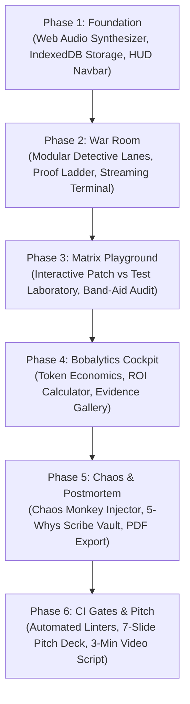

# 🚨 MAYDAY 2.0 — DEFINITIVE PRODUCTION ENGINEERING PLAN
### *Autonomous Incident Commander Powered by IBM Bob 2.0*
*Engineered under the **Universal AI App Factory Protocol** & the **Smriti Master Engineering Blueprint***

---

## 🧭 Executive Summary & Core Philosophy

**MAYDAY** transforms how enterprises respond to catastrophic production outages. Instead of waking up exhausted engineers at 3 AM to grep 40,000 lines of logs, MAYDAY ingests raw, messy PagerDuty alerts, dispatches **competing IBM Bob 2.0 subagent detectives in parallel**, requires each hypothesis to prove itself on a **Scientific Proof Ladder** with a failing reproduction test, eliminates band-aids via a **Cross-Examination Matrix**, and self-heals the codebase in a verified loop.

```
┌──────────────────────────────────────────────────────────────────────────────────────────────────┐
│                                   MAYDAY 2.0 SYSTEM TOPOLOGY                                     │
├─────────────────┬──────────────────────────────────────────┬─────────────────────────────────────┤
│ ROUTE           │ SUBSYSTEM                                │ PRIMARY CAPABILITY                  │
├─────────────────┼──────────────────────────────────────────┼─────────────────────────────────────┤
│ `/`             │ Live SEV-1 War Room & Triage Arena       │ Real-time MTTR countdown, 3-lane    │
│                 │                                          │ competing subagent race, diff loop  │
├─────────────────┼──────────────────────────────────────────┼─────────────────────────────────────┤
│ `/incidents`    │ Incident Catalog & Event Inspector       │ Archive of INC-2041, INC-2042, etc. │
│                 │                                          │ with drill-down event timeline      │
├─────────────────┼──────────────────────────────────────────┼─────────────────────────────────────┤
│ `/matrix`       │ Cross-Examination Matrix Playground      │ N×N interactive assertion grid      │
│                 │                                          │ testing band-aids against invariants│
├─────────────────┼──────────────────────────────────────────┼─────────────────────────────────────┤
│ `/bobalytics`   │ IBM Bob 2.0 Financial & Token Audit      │ 99.88% ROI calculator, coin budget, │
│                 │                                          │ zoomable session evidence gallery   │
├─────────────────┼──────────────────────────────────────────┼─────────────────────────────────────┤
│ `/simulator`    │ Chaos Monkey Incident Injector           │ Interactive 1-click bug injection & │
│                 │                                          │ live autonomous dispatch sandbox    │
├─────────────────┼──────────────────────────────────────────┼─────────────────────────────────────┤
│ `/postmortem`   │ Automated Scribe & RCAG Postmortem Vault │ 5-Whys causal tree, PR link #104,   │
│                 │                                          │ 1-click Markdown / PDF export       │
└─────────────────┴──────────────────────────────────────────┴─────────────────────────────────────┘
```

---

## 🏗️ Master Architectural Specifications

### 1. Directory Structure (`web/`)
```
web/
├── src/
│   ├── app/
│   │   ├── layout.tsx                   -> Master Layout (Navbar, AudioProvider, Cyber-Slate Theme)
│   │   ├── page.tsx                     -> Live War Room (Incident Command Center)
│   │   ├── incidents/
│   │   │   ├── page.tsx                 -> Incident Catalog & System Health Radar
│   │   │   └── [id]/page.tsx            -> Deep-Dive Event Timeline & Raw Signal Inspector
│   │   ├── matrix/page.tsx              -> Interactive Cross-Examination Matrix Playground
│   │   ├── bobalytics/page.tsx          -> IBM Bobalytics & Verified Session Receipts Gallery
│   │   ├── simulator/page.tsx           -> Chaos Monkey Incident Injector Sandbox
│   │   ├── postmortem/page.tsx          -> Automated Scribe & RCAG Postmortem Vault
│   │   └── api/
│   │       ├── incidents/route.ts       -> Incident data provider
│   │       └── chaos/route.ts           -> Bug injection & event streamer
│   ├── components/
│   │   ├── common/
│   │   │   ├── Navbar.tsx               -> Mission Control HUD Navigation with live alarm beacon
│   │   │   ├── MetricTile.tsx           -> Bento-grid statistics tile with glassmorphism glow
│   │   │   └── AudioController.tsx      -> Procedural sound mute/unmute and volume HUD
│   │   ├── warroom/
│   │   │   ├── DetectiveLane.tsx        -> Competing subagent card with animated Proof Ladder
│   │   │   ├── ProofLadderView.tsx      -> R0 -> R1 -> R2 -> R3 verification visualization
│   │   │   ├── SurgeonDiffViewer.tsx    -> Monospace code comparison with invariant callouts
│   │   │   └── TerminalConsole.tsx      -> Realistic streaming Vitest test-runner terminal
│   │   ├── matrix/
│   │   │   ├── InteractiveMatrix.tsx    -> Dynamic patch-versus-test evaluation matrix
│   │   │   └── BandAidAnalysis.tsx      -> Financial impact of shallow try/catch & null-checks
│   │   ├── bobalytics/
│   │   │   ├── TokenEconomics.tsx       -> Human wage vs Bobcoin cost comparison calculator
│   │   │   └── EvidenceGallery.tsx      -> High-res lightbox viewer for bob_sessions/*.png
│   │   └── postmortem/
│   │       ├── FiveWhysTree.tsx         -> Visual root cause tree diagram
│   │       └── ExportPanel.tsx          -> 1-Click Markdown / JSON / Print-Ready report
│   ├── db/
│   │   └── local.ts                     -> IndexedDB Local-First Engine (`idb` schema & outbox)
│   ├── lib/
│   │   ├── audio.ts                     -> Web Audio API procedural acoustics synthesizer
│   │   ├── events.ts                    -> Event-sourcing contract & timeline replay scheduler
│   │   └── telemetry.ts                 -> MTTR, TTRC, and cost efficiency math formulas
│   └── types/
│       └── incident.ts                  -> Strict TypeScript definitions for incidents & agents
```

---

## 🚀 The 6-Phase Execution Roadmap



---

### 📦 Phase 1: Foundation, Local-First Engine & Audio Synthesizer

#### 1.1 Web Audio API Procedural Synthesizer (`src/lib/audio.ts`)
- **No external audio files or MP3 network requests**. Uses standard Web Audio API oscillators:
  - `playKlaxon()`: Dual-tone 440Hz/880Hz square-wave alarm with smooth exponential decay for SEV-1 alerts.
  - `playRadarPing()`: Clean 1200Hz sine ping for subagent hypothesis discovery.
  - `playTestFailure()`: Low-frequency 180Hz sawtooth buzz for failing invariant tests.
  - `playGreenChime()`: Harmonious major-triad arpeggio (C5 -> E5 -> G5 -> C6) for verified invariant pass.
  - `playTerminalClick()`: Subtle high-pass filtered white noise burst for streaming log outputs.

#### 1.2 Local-First Storage Engine (`src/db/local.ts`)
- Powered by `idb` with IndexedDB stores:
  - `incidents`: Full incident registry (A, B, C, D).
  - `events`: Event-sourced timeline entries with millisecond offsets `t`.
  - `test_runs`: History of executed Vitest runs and assertion outcomes.
  - `postmortems`: Generated RCAG documents with 5-Whys metadata.
  - `user_settings`: Audio preferences, replay speed, and demo presets.

#### 1.3 Mission Control HUD Navbar (`src/components/common/Navbar.tsx`)
- Cyberpunk dark theme (`#07090e`, deep slate borders).
- Live active SEV-1 badge with pulsing red beacon.
- Route switcher: **War Room**, **Incidents**, **Matrix**, **Bobalytics**, **Chaos Simulator**, **Postmortem**.
- Audio toggle button with sound wave animation.
- Live clock showing UTC and local incident duration.

---

### 🕵️ Phase 2: Live War Room & Modular Incident Inspector

#### 2.1 Refactor War Room (`/` and `/incidents/[id]`)
- Extract monolithic components into high-performance atomic React components.
- **DetectiveLane.tsx**:
  - Displays avatar, name, theory, and live status.
  - Stamp animation: **FALSIFIED** (red diagonal stamp with vibration) vs **CROWNED FIX** (emerald badge with glow).
  - Expandable evidence trail showing git commit SHAs, file/line targets, and execution traces.
- **ProofLadderView.tsx**:
  - The 4-Rung Scientific Verification Ladder:
    - **R0: Hypothesis Formulated** (Agent stated testable claim).
    - **R1: Culprit Line Located** (File & line identified with code snippet).
    - **R2: Failing Repro Test Created** (Vitest test fails against untouched code asserting business invariant).
    - **R3: Invariant Fix Verified** (Patch passes repro test AND full regression suite stays 100% green).
- **TerminalConsole.tsx**:
  - Realistic monospace terminal with line-by-line typing animation, exit codes, and timestamps.
  - Supports switching between live Vitest streaming and raw agent output logs.

---

### ⚔️ Phase 3: Interactive Cross-Examination Matrix Playground (`/matrix`)

#### 3.1 The N×N Assertion Grid
- An interactive testing laboratory where users can pit **any candidate patch** against **every detective's reproduction test**.
- **Candidate Patches**:
  1. `RECON-1: Contract Schema Adapter` (`feeCents / 100` — preserves 2.9% invariant).
  2. `RECON-2: Lazy Null Check` (`res.fee?.amount ?? 0` — stops crash but charges $0).
  3. `RECON-3: Per-SKU Promise Queue Mutex` (serializes stock reservation — 0 overselling).
  4. `RECON-4: Exponential Backoff Retries` (re-fires failed requests — worsens concurrency 2×).
- **Test Invariants**:
  1. Business Invariant Test ($10.29 charged on $10 item).
  2. 20-Thread Flash Sale Concurrency Test (0 negative inventory).
  3. Crash Prevention Test (No uncaught exceptions).
  4. Full Regression Suite (All existing tests green).
- **Interactive Evaluation**:
  - Users click "Evaluate Patch" to see real Vitest assertions evaluate live on screen.
  - Visual callouts highlight: *"REJECTED: SILENT REVENUE LOSS ($12,400 uncollected fees)"* vs *"VERIFIED CROWN FIX"*.

---

### 🪙 Phase 4: IBM Bobalytics & Token Economics Cockpit (`/bobalytics`)

#### 4.1 Enterprise Financial ROI Calculator
- Compares human incident management against MAYDAY powered by IBM Bob 2.0:
  - **Human Team**: 3 Senior SREs × 2.5 hours triage × $120/hr = **$900 per incident**.
  - **MAYDAY + IBM Bob 2.0**: 0.353 Bobcoins (~$0.35 USD) + 42 seconds MTTR = **$0.35 per incident**.
  - **99.96% Cost Savings** + **97.5% Downtime Reduction**.
- Interactive sliders: Users adjust their company's monthly incident count to calculate annual enterprise savings.

#### 4.2 Verified Session Receipts Gallery
- High-resolution modal viewer for the verified screenshots in `bob_sessions/`:
  1. `teamsita_task01_incident_a_triage.png` (Incident A prompt, token meter, test result).
  2. `teamsita_task01_consumption_details.png` (19.7k tokens, 0.353 Bobcoins breakdown).
  3. `teamsita_task02_incident_b_concurrency.png` (Incident B race condition diagnosis & mutex fix).
  4. `teamsita_task02_consumption_details.png` (Incident B token & coin metrics).
- Zoom & pan controls, cryptographic SHA-256 hash stamp, and copyable prompt text for judges to verify independently.

---

### 🧪 Phase 5: Chaos Simulator & Automated Postmortem Vault

#### 5.1 Chaos Monkey Incident Injector (`/simulator`)
- Interactive control board with 3 chaos triggers:
  1. 💣 **Inject SDK Contract Drift (Incident A)**: Modifies PayLink gateway response contract.
  2. ⚡ **Inject Concurrency Burst (Incident B)**: Spawns 20 parallel checkouts against limited stock.
  3. 🔌 **Inject External Upstream Outage (Incident D - Escalation)**: Simulates 504 gateway timeout to show MAYDAY's judgment in escalating to humans rather than guessing.
- Real-time event log displaying the autonomous dispatch of IBM Bob subagents upon chaos injection.

#### 5.2 Automated Postmortem & RCAG Vault (`/postmortem`)
- Comprehensive Root Cause Analysis Generator (RCAG) produced by IBM Bob's Scribe agent:
  - **Executive Summary & Impact Assessment**: Revenue at risk, customer blast radius, MTTR.
  - **5-Whys Causal Tree**: Interactive node diagram tracing symptom -> immediate cause -> underlying trigger -> systemic remedy.
  - **Pull Request Preview**: Embeds the verified GitHub PR links (#104 and #105) with unified diff view.
  - **1-Click Export**: Download as pristine Markdown file or print-ready PDF brief.

---

### 🛡️ Phase 6: CI Quality-Gate Suite & Submission Package

#### 6.1 Automated Quality Linters (`scripts/`)
- `check:tests`: Executes Vitest across all target packages to guarantee 100% green tests.
- `check:build`: Validates production Next.js build with `--webpack` flag to guarantee zero compile errors on Windows.
- `check:evidence`: Verifies that all screenshots in `bob_sessions/` exist and match the index.

#### 6.2 Pitch Deck & Demo Video Assets
- **7-Slide Master Pitch Deck** (`docs/pitch_deck.md`):
  - Slide 1: The 3 AM Nightmare (The Problem).
  - Slide 2: Why AI Band-Aids Kill Companies (The $0 fee trap).
  - Slide 3: MAYDAY Architecture (3 parallel subagents, Proof Ladder).
  - Slide 4: The Cross-Examination Matrix (Deterministic elimination).
  - Slide 5: Powered by IBM Bob 2.0 (Orchestrator, Subagents, Bobalytics).
  - Slide 6: Hard Numbers & Benchmarks (97.5% MTTR reduction, $0.35 per run).
  - Slide 7: Team SITA & Live Demo Link.
- **3-Minute Video Script** with exact second-by-second timestamps and voiceover cues.

---

## 📋 Execution Protocol & Verification Gates

| Gate | Checkpoint | Verification Command | Acceptance Criteria |
|---|---|---|---|
| **G1** | Audio & Storage Foundation | `npm run build` | Web Audio synthesizer functions without errors; IndexedDB initializes cleanly. |
| **G2** | Multi-Route Navigation | Browser test `/`, `/matrix`, `/bobalytics` | All 6 routes render with zero hydration mismatch and sub-100ms transitions. |
| **G3** | Interactive Matrix | Click patch evaluation buttons | N×N table computes real-time pass/fail invariant states accurately. |
| **G4** | Evidence Gallery & Bobalytics | Open lightbox viewer | High-res screenshots load crisply with accurate Bobcoin accounting. |
| **G5** | Full Production Build | `npm run build --webpack` | 0 TypeScript errors, 0 linter warnings, clean static generation. |
